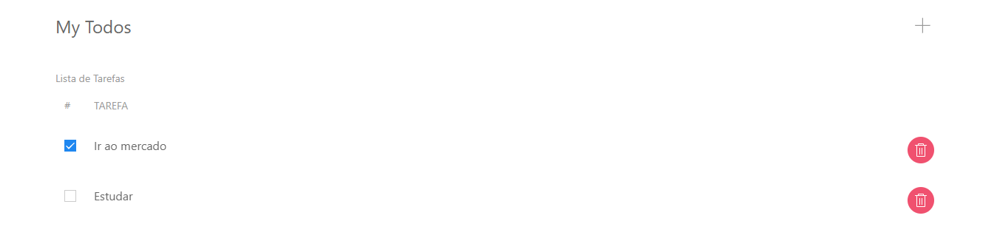
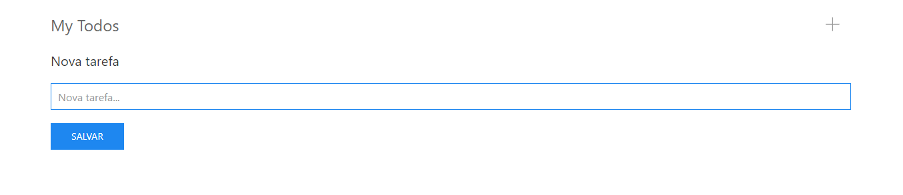

<h1 align="center">
    #App todos(Lista de Tarefas) em React JS
</h1>

  
  
  

## 🚀 Objetivo
Esse projeto consiste em uma página em React JS, que permite adicionar, remover e editar o estado da tarefa de completo para incompleto e vice-versa.
Os dados são persistidos no Local Storage, espaço disponível, para armazenamento no navegador.

## Index

  

## Add Todos(Tarefas)

  

